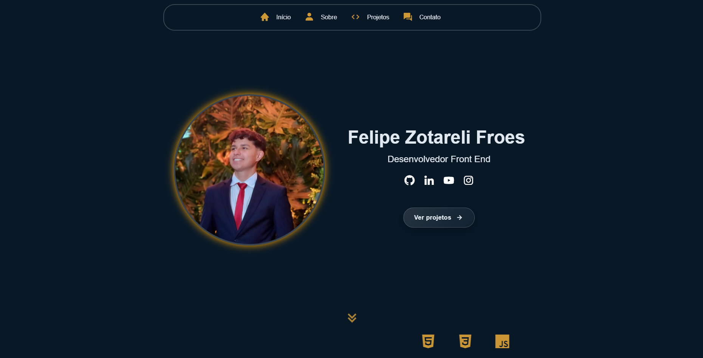

# Personal Portfolio Website

My personal portfolio website developed to showcase my projects, technical skills, and professional journey as a front-end developer.

## 🚀 Technologies
- HTML5
- CSS3
- JavaScript

## 📌 Sections
- About Me
- Projects
- Technologies
- Contact

## 🎯 Purpose
This portfolio was built to establish my professional online presence and demonstrate my front-end development skills through real projects.

## 📚 What I Learned
- Structuring a professional portfolio
- Project presentation techniques
- Responsive web design
- Improving user experience and navigation

## 🔗 Live Demo
https://felipezfroes.com

## 💻 How to Run
Clone the repository and open `index.html` in your browser.
